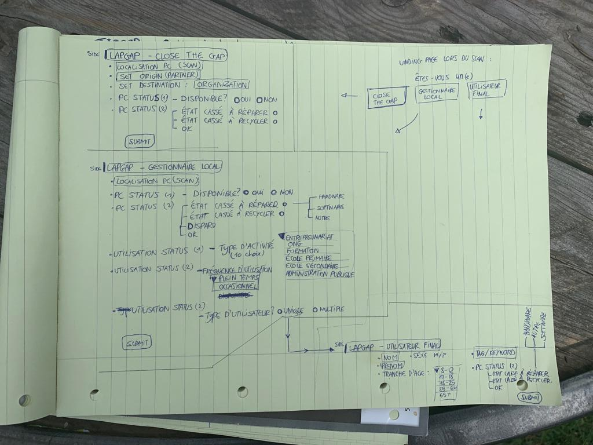
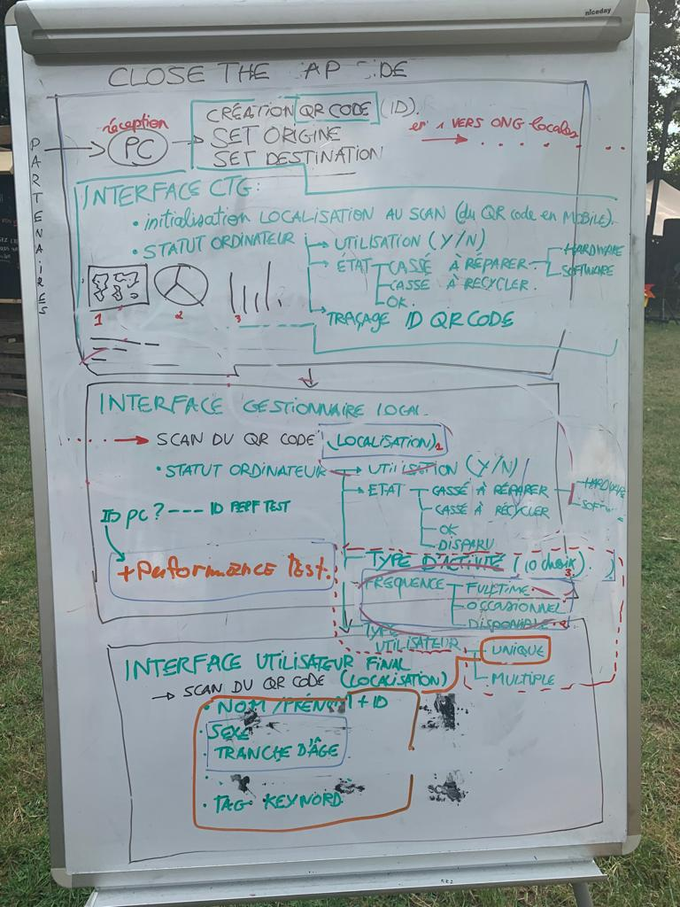
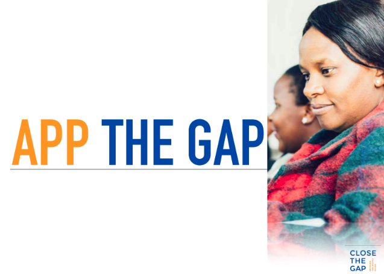

# Notes

## QA avec Close the Gap
- Les partenaires receveurs peuvent avoir plusieurs personnes de contact pas situées au même endroit.
- Les partenaires donateurs proviennent à 80% de la Belgique et des Pays-Bas. Puis viennent la France, la Grande Bretagne, le Luxembourg, la Suisse.
- La fréquence des rapports d'état des ordinateurs devrait se faire idéalement tous les deux mois mais en vérité, ils font un rapport annuel à la moitié de l'année. Il faudrait avoir les infos pour cette période.
- Faut-il des informations concernant l'activité, l'utilisation des ordinateurs ? Non. Le mieux serait de savoir combien d'heures l'ordinateur est utilisé mais surtout s'il fonctionne.

## PC Localisation - Problématique

Trois utilisateurs :
- Le **gestionnaire de la flotte** : Close the Gap. Il reçoit des PC puis les redistribue à des gestionnaires locaux.
- Le **gestionnaire local** : il s'agit du partenaire qui reçoit les ordinateurs, les gère sur place, renseigne pour quelle utilisation les PC vont être occupés.
- L'**utilisateur final** : la personne qui va utiliser l'ordinateur.

### Le gestionnaire de la flotte

- Les PC offerts ont en moyenne 2-5 ans de durée de vie après au reconditionnement (recyclés a posteriori localement),
- Les utilisateurs (personnes ou organisations) doivent avoir confiance dans les PC utilisés, notre système de localisation/monitoring est une garantie de qualité.
- Le gestionnaire local ne DEMANDE pas un remplacement (il signale/communique qu'un pc du réseau est out), Close The Gap est informé et procéde au remplacement logistique. 
- Les gestionnaires locaux & Close The Gap devraient avoir un système de suivi : en plus d'un avantage logistique sur l'état/statut (! fonctionne/ne fonctionne pas) du PC, ils veulent savoir où ils vont et à quel but, quels projets (!) ils auront servi.
- Il faut mettre en place un système de monitoring géolocalisé du statut de PC et son utilisation (projet + infos users de base)

#### 📜 Storytelling 
Les gestionnaires de flotte reçoivent les ordinateurs des partenaires donateurs, ils (Close the Gap ou les partenaires donateurs eux-même) impriment des étiquettes avec les QR code et les ID Close the Gap. Ils les collent sur les ordinateurs. Ils les scannent puis renseignent simplement le numéro de série de la machine.

#### Fonctionnalités

##### Schéma Shipping (changement localisation physique)
Même système que pour DHL, TNT,... Doit pouvoir fonctionner pour un ET plusieurs laptops.

**ENVOI**

1. set **origine** et destination
2. scan du QR Code
3. envoi physique

**RECEPTION**

1. réception physique
2. set **destination**
3. scan du QR code pour confirmer les réception
4. Le(s) machine(s) sont automatiquement ajoutée(s) au listing des machines présentes sur le site du gestionnaire local.

### Schéma Attribution de laptops (un ou plusieurs)
- vérifier le statut
- changer le statut.

#### Pour changer le statut pour Close the Gap
1. Définir le pays
2. Définir la région
3. Définir la ville
4. Définir le partenaire

#### Pour changer le statut pour gestionnaire local
1. Définir la localité/projet
2. Définir si pour un ou plusieurs utilisateurs
- Si un utilisateur => L'utilisateur final, en scannant le QR code, pourra se créer un compte sur la plateforme pour renseigner l'état de son ordinateur depuis son smartphone.
- Si plusieurs utilisateurs, cela signifie que c'est pour un usage occasionnel et non personnel. Pas de compte d'utilisateur à créer mais le gestionnaire local peut attribuer un tag pour savoir pour quelles raisons l'ordinateur va être utiliser.

## Interfaces

### INTERFACE Close The Gap : 
Localisation au scan du QR Code :
- Traçage
    - numéro de série de la machine
    - ID Close The Gap
    - QR CODE
- Localisation
        - pays, 
        - région, 
        - ville, 
        - nom du partenaire
- statut d'ordinateur 
    - (premier encodage), 
    - utilisation (y/n), 
    - état 
        - OK
        - cassé à réparer
            - hardware, 
            - software, 
            - panne non identifée 
        - cassé à recycler
    - disparu/volé

Toutes les infos qui suivent seront dispos pour Close The Gap

=> tout cela crée un historique et donc un rapport sur la vie du PC

### INTERFACE Gestionnaire local :
Au scan du QR code :
- Localisation
    - pays, 
    - région, 
    - ville, 
    - tag pour projet/classe
- statut d'ordinateur, 
    - En stock
        - yes
        - no
    - état
        - OK
        - cassé à réparer 
            - hardware 
            - software 
            - panne non identifiée
        - cassé à recycler 
        - disparu/volé, 
- type activité
    - Education
    - Innovation
    - Digital Skills
    - Gender (inclusion)
    - Social
    - Migration
    - Healthcare
- type d'utilisateur : 
    - unique (si unique, alors possibilité pour l'utilisateur d'avoir un profil user dans l'application)
    - multiple
- fréquence 
    - full time
    - occasionnel

### INTERFACE Utilisateur Final (si type user unique) : 
- nom, 
- prénom, 
- sexe, 
- tag/keyword. Pour renseigner le nom de la classe ou du projet auquel la machine va servir.
- tranche age

## Gamification

Les utilisateurs finaux doivent prendre soin des ordinateurs. Au plus, les gens autour de lui auront pris soin ce l'objet, au plus il est content.
Pour continuer à prendre soin de l'ordi, on lui dit de faire plusieurs trucs : 
Badge assigné à l'ordinateur, pas à la personne. La personne reçoit donc un ordinateur avec un historique, un vécu.
- RunTest 2x/mois (1 badge) pour avoir des informations sur l'état de la machine.
- Questions caca (1 badge)
- Donner des précisions sur l'utilisation et les projets que tu fais. (1 badge)
Stickers sont donnés avec les ordinateurs (physiques) et stockés sur la plateforme pour faire foi.

## Pictures of our notes

[Link towards our PDF presentation](doc/AppTheGap_ShortPresentation.pdf)

